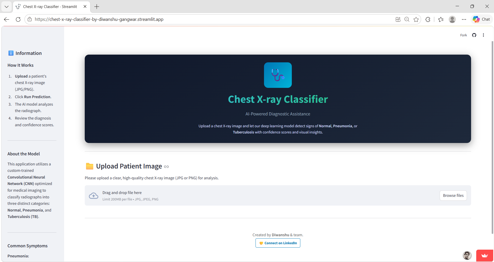
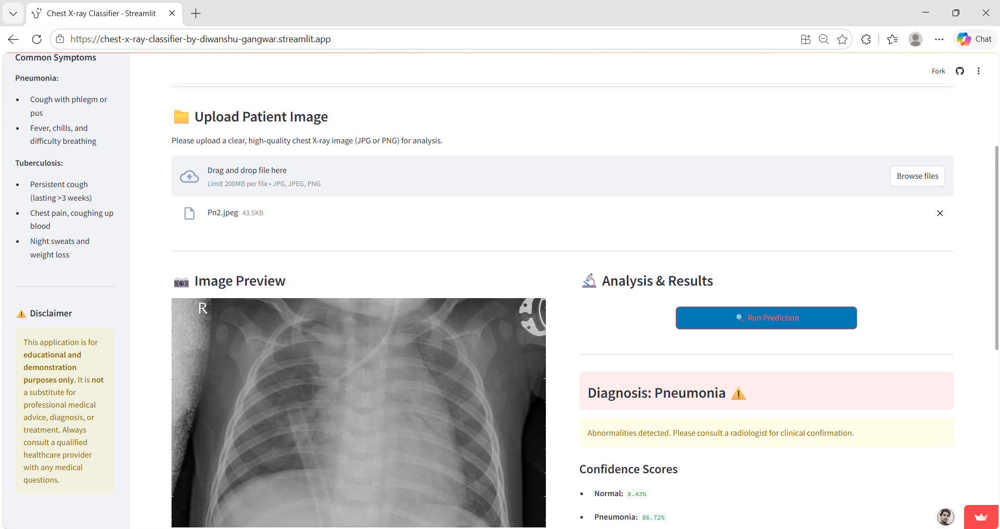
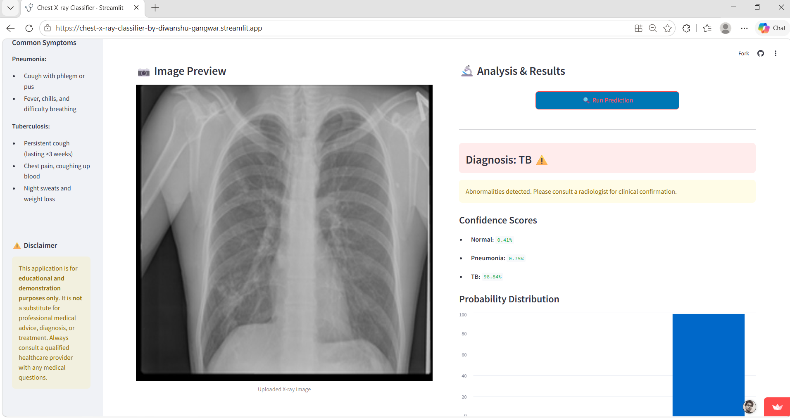
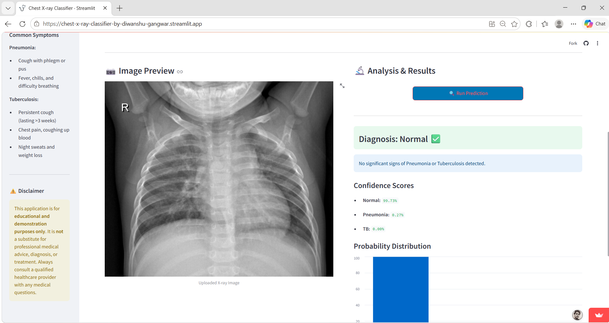

# AI-Based Chest X-ray Classification System

Deep learning-based chest X-ray classification system for detecting:

- Normal
- Pneumonia
- Tuberculosis (TB)

Developed by Diwanshu Gangwar

---

## Live Demo

https://chest-x-ray-classifier-by-diwanshu-gangwar.streamlit.app/

---

## Screenshots

### Home Interface

### Pneumonia Prediction

### Tuberculosis Prediction

### Normal Prediction

---

## Project Overview

This project presents a medical imaging classification system built using deep learning and transfer learning techniques. The application analyzes chest X-ray images and predicts whether the case is Normal, Pneumonia, or Tuberculosis.

The model is deployed as an interactive Streamlit web application that allows real-time predictions through a simple user interface.

---

## Dataset Details

| Category | Details |
|---|---|
| Total Images | 9,298 |
| Training Images | 6,543 |
| Validation Images | 1,391 |
| Test Images | 1,364 |
| Classes | Normal, Pneumonia, TB |

---

## Model Architecture

- Initial experimentation performed using EfficientNet
- Final model based on DenseNet121
- Transfer learning used for feature extraction
- Fine-tuning applied for improved classification performance

---

## Model Performance

### ROC-AUC Scores

| Class | Score |
|---|---|
| Normal | 0.988 |
| Pneumonia | 0.990 |
| Tuberculosis | 0.998 |

### Precision-Recall

- TB PR-AUC: 0.992

### Observations

- Strong classification performance across all classes
- High sensitivity for Tuberculosis detection
- Minor confusion observed between Normal and Pneumonia samples

---

## System Performance

| Metric | Value |
|---|---|
| Total Parameters | 7,040,579 |
| Trainable Parameters | 2,161,155 |
| Model Size | 47 MB |
| Average Latency | ~403 ms/image |
| Throughput | ~0.68 images/sec |

---

## Features

- Chest X-ray image upload
- Real-time prediction
- Deep learning-based inference
- Streamlit web deployment
- Transfer learning pipeline

---

## Tech Stack

- Python
- TensorFlow
- DenseNet121
- EfficientNet
- Streamlit
- Git & GitHub

---

## Workflow

1. User uploads a chest X-ray image
2. Image preprocessing is applied
3. The image is passed through the trained DenseNet121 model
4. Class probabilities are generated
5. Prediction results are displayed in the interface

---

## Limitations

- Trained on a limited dataset
- Not clinically validated
- Possible misclassification in visually similar cases

---

## Future Improvements

- Increase dataset diversity and size
- Improve model generalization
- Optimize inference speed
- Deploy scalable backend APIs

---

## Support

If you found this project useful, consider giving it a star ⭐ on GitHub.